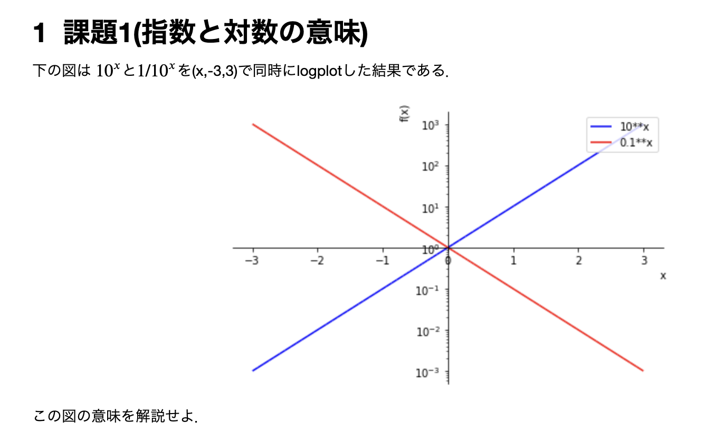

#+OPTIONS: ^:{}
#+STARTUP: indent nolineimages overview num
#+TITLE: mk_stack_dir
#+AUTHOR: Shigeto R. Nishitani
#+EMAIL:     (concat "shigeto_nishitani@mac.com")
#+LANGUAGE:  jp
#+OPTIONS:   H:4 toc:t num:2
#+HTML_HEAD: <link rel="stylesheet" type="text/css" href=".style_w_link_button.css" />
#+MACRO: dummy_link @@html:<a href="#">$1</a>@@

# for style.css, never move from here
[[../d1_init/readme.html][prev_button]]
[[../symbolic_math_hc.html][up_button]]
[[../d3_diff_int/readme.html][next_button]]
# for a real link rewrite usual [[\url][]]

| 

* d2_0929 対数(log)
 | グループ課題      | [[file:gw1_exp_log.ipynb]]     | [[https://nbviewer.org/github/daddygongon/jupyter_num_calc/blob/main/symbolic_math/./group_works/gw1_exp_log.ipynb][nbviewer]] |
 | 補足資料          | [[file:functions.ipynb]]       | [[https://nbviewer.org/github/daddygongon/jupyter_num_calc/blob/main/symbolic_math/./ipynb_txt/functions.ipynb][nbviewer]] |
 | 補足資料          | [[file:equals.ipynb]]          | [[https://nbviewer.org/github/daddygongon/jupyter_num_calc/blob/main/symbolic_math/./ipynb_txt/equals.ipynb][nbviewer]] |
 |-------------------+-----------------------+----------|
 | （次週提出の)宿題 | [[file:differential.ipynb]]    | [[https://nbviewer.org/github/daddygongon/jupyter_num_calc/blob/main/symbolic_math/./ipynb_txt/differential.ipynb][nbviewer]] |
 | （次週提出の)宿題 | [[file:integral.ipynb]]        | [[https://nbviewer.org/github/daddygongon/jupyter_num_calc/blob/main/symbolic_math/./ipynb_txt/integral.ipynb][nbviewer]] |
 |-------------------+-----------------------+----------|
 | 解答例            | [[file:gw1_exp_log_ans.ipynb]] | [[https://nbviewer.org/github/daddygongon/jupyter_num_calc/blob/main/symbolic_math/./gw_ans/gw1_exp_log_ans.ipynb][nbviewer]] |

** 注意
- 課題提出(d2_0929)
  - 参考資料を横目で見ながら，今週(d2_0929_log)の提出課題を仕上げてください．
  - 先週の宿題(first_leaf.ipynb)とともに，LUNAへグループで一人がpdfとipynbをあげてください． 
  - 相方の名前と学籍番号を提出ファイルの先頭に忘れずに記入しておいてください．
  - 締め切りは今日(9/29)の夜中の12時です．

- pdfでの出力
  1. File -> Save and Export as -> html 
  1. 保存されたhtmlをブラウザで開いて 
  1. ブラウザ側で印刷(Ctrl-p) -> 印刷画面でpdf保存

* install error
** user
再インストールしてjupyterを立ち上げ，newを選んだところ，
File Save Error for Untitlle.ipynbと出て，
Failed to fetchと表示されています．何が悪いんでしょう？

だったんですが，意外と深いところのエラーでした
** user
Anaconda promptでjupyter notebookを打ち込んだところ，
browserが立ち上がりました．
しかし，Saving file at Untitled1.ipynbにおいて，
Bad file desciptorとなっています．
epoll.cpp:73です

** gemini
pyzmq (ZeroMQ) というパッケージと
Windows環境の相性問題（またはユーザー名が原因の問題）

と特定．
** user
ごちゃごちゃやってたんですが，

python 3.14.6だと伝えたところ

** answer
: pip install pyzmq --only-binary=:all: --upgrade --pre

で解決．やれやれ

