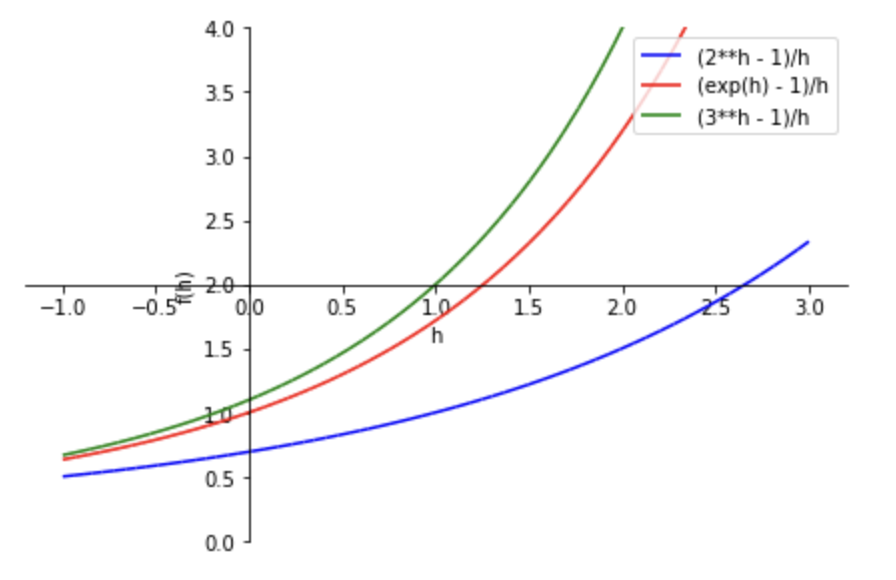

#+OPTIONS: ^:{}
#+STARTUP: indent nolineimages overview num
#+TITLE: d3 1006 微積分
#+AUTHOR: Shigeto R. Nishitani
#+EMAIL:     (concat "shigeto_nishitani@mac.com")
#+LANGUAGE:  jp
#+OPTIONS:   H:4 toc:t num:2
#+HTML_HEAD: <link rel="stylesheet" type="text/css" href=".style_w_link_button.css" />
#+MACRO: dummy_link @@html:<a href="#">$1</a>@@

# for style.css, never move from here
[[../d2_log/readme.html][prev_button]]
[[../symbolic_math_hc.html][up_button]]
[[../d0_anounce/readme.html][next_button]]
# for a real link rewrite usual [[\url][]]

| 

* d3_1006:微積(diff and int)
** 教材(ipynbs)
| 項目              | ipynb files                       | viewer   |
|-------------------+-----------------------------------+----------|
| （今週提出の)宿題 | [[file:../d2_log/differential.ipynb]] | [[https://nbviewer.org/github/daddygongon/jupyter_num_calc/blob/main/symbolic_math/./ipynb_txt/differential.ipynb][nbviewer]] |
| （今週提出の)宿題 | [[file:../d2_log/integral.ipynb]]     | [[https://nbviewer.org/github/daddygongon/jupyter_num_calc/blob/main/symbolic_math/./ipynb_txt/integral.ipynb][nbviewer]] |
|-------------------+-----------------------------------+----------|
| グループ課題      | [[file:gw2_diff.ipynb]]               | [[https://nbviewer.org/github/daddygongon/jupyter_num_calc/blob/main/symbolic_math/group_works/gw2_diff.ipynb][nbviewer]] |
| ans               | [[file:gw2_diff_ans.ipynb]]           | ([[https://nbviewer.org/github/daddygongon/jupyter_num_calc/blob/main/symbolic_math/group_works/gw2_diff_ans.ipynb][viewer]]) |
|-------------------+-----------------------------------+----------|
| 次週提出の宿題    | [[file:linear_algebra_scipy.ipynb]]   | [[https://nbviewer.org/github/daddygongon/jupyter_num_calc/blob/main/symbolic_math/ipynb_txt/linear_algebra_scipy.ipynb][nbviewer]] |
|-------------------+-----------------------------------+----------|

# |----------------+----------------------------+----------|

